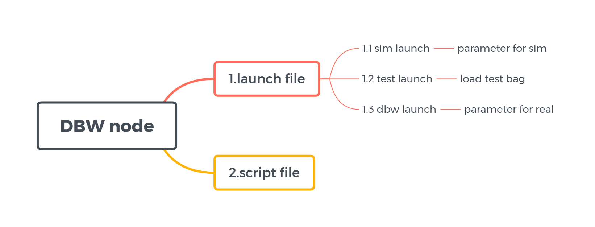
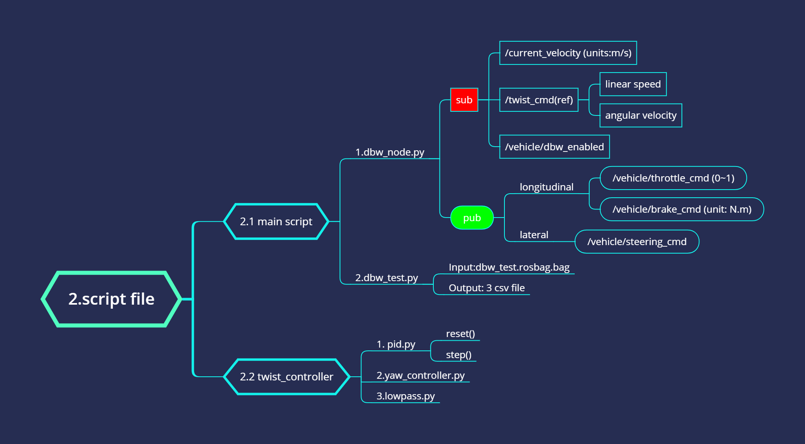
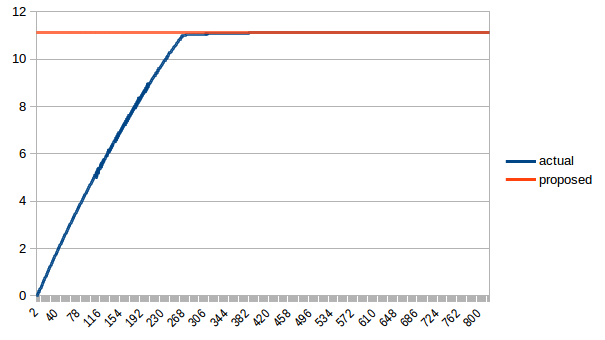

# Udacity Self-Driving Car - Capstone Project(Team Mars)

## Overivew
This is the project repo for the final project of the Udacity Self-Driving Car Nanodegree: Programming a Real Self-Driving Car. 

* Team : Mars

| Name           | Udacity account       | Slack Handle | Time Zone         |
|:---------------|:----------------------|--------------|-------------------| 
| italo jose     | italo.i@live.com      | @italojs     | UTC-3 (Brazil)    |
| Yu Han         | hanyuon@163.com       | @leo         | UTC+8 (China)     |  
| your_name      | your@email.com        | @NickName    | UTC-3             |
| your_name      | your@email.com        | @NickName    | UTC-3             |
| Gao Hang       | gaohangfr@hotmail.com | @sq03064140  | UTC+8 (China)     |

### Architecture

Ros system have 4 parts: Car/Simulator module, Perception module, Planning module, Control module
- Percetion: Using sensors to detecte enviroment.

- Planning:

- Control: The control module have 2 subsystem:**DBW Node** and **Waypoint Follower**. DBW node is an actuator controller,it make sure the each actuator can work as the propose value(longitudinal). Waypoint Follower normally we call it motion controller. This module integrate acutators, tire, ground, etc. Control the vehicle as a whole system.**Waypoint Follower** recevie the msgs from the planning and send the twist command(v, $\omega$) to the DBW.


---
## Ros Modules

### **1.Car/Simulator**


### **2.Perception**


### **3.Planning**


### **4.Control**


#### 4.1 Waypoint Follower(motion control)
This node was given by Udacity. It receive /final_waypoints and publishe proposed /twist_cmd. This node realize by method pure-pursuit.You can find more detail in [Chaptier 2.2](https://www.ri.cmu.edu/pub_files/2009/2/Automatic_Steering_Methods_for_Autonomous_Automobile_Path_Tracking.pdf)


#### 4.2 DBW Node
This node is responsible for acutatos control. It decomposition of the speed(linear,angular) into actuator control instructions.(In real world the instuction often use voltage/current)



The `throttle` of dbw_node is completed follow the steps:
1. 1st commits, use the code from the [workthrough](https://classroom.udacity.com/nanodegrees/nd013/parts/6047fe34-d93c-4f50-8336-b70ef10cb4b2/modules/e1a23b06-329a-4684-a717-ad476f0d8dff/lessons/462c933d-9f24-42d3-8bdc-a08a5fc866e4/concepts/6546d82d-6028-4210-a4b0-9d559662a881)
2. analysis the module. 
- **PID**:Add an integrate switcher to restrain the too big integrate values(pid.py line 21-25);
- **PID**:Add a restrain of kd(pid.py line 30);
- **Max pedal**:Augment the max of the pedal value to 0.8.
3. use the **dbw_test.py** to test the paramters.
4. finally plot the speed-up curve


```
acc_kp = 1.5
acc_ki = 0.003
acc_kd = 3.5
```

In real world design the auto-EPS and AEB controllers is very hard. But in this project it simplify a linear system,so I use the code from the workthrough directly. 


---------------------------------UDACITY ORIGINAL README---------------------------------

This is the project repo for the final project of the Udacity Self-Driving Car Nanodegree: Programming a Real Self-Driving Car. For more information about the project, see the project introduction [here](https://classroom.udacity.com/nanodegrees/nd013/parts/6047fe34-d93c-4f50-8336-b70ef10cb4b2/modules/e1a23b06-329a-4684-a717-ad476f0d8dff/lessons/462c933d-9f24-42d3-8bdc-a08a5fc866e4/concepts/5ab4b122-83e6-436d-850f-9f4d26627fd9).

Please use **one** of the two installation options, either native **or** docker installation.

### Native Installation

* Be sure that your workstation is running Ubuntu 16.04 Xenial Xerus or Ubuntu 14.04 Trusty Tahir. [Ubuntu downloads can be found here](https://www.ubuntu.com/download/desktop).
* If using a Virtual Machine to install Ubuntu, use the following configuration as minimum:
  * 2 CPU
  * 2 GB system memory
  * 25 GB of free hard drive space

  The Udacity provided virtual machine has ROS and Dataspeed DBW already installed, so you can skip the next two steps if you are using this.

* Follow these instructions to install ROS
  * [ROS Kinetic](http://wiki.ros.org/kinetic/Installation/Ubuntu) if you have Ubuntu 16.04.
  * [ROS Indigo](http://wiki.ros.org/indigo/Installation/Ubuntu) if you have Ubuntu 14.04.
* [Dataspeed DBW](https://bitbucket.org/DataspeedInc/dbw_mkz_ros)
  * Use this option to install the SDK on a workstation that already has ROS installed: [One Line SDK Install (binary)](https://bitbucket.org/DataspeedInc/dbw_mkz_ros/src/81e63fcc335d7b64139d7482017d6a97b405e250/ROS_SETUP.md?fileviewer=file-view-default)
* Download the [Udacity Simulator](https://github.com/udacity/CarND-Capstone/releases).

### Docker Installation
[Install Docker](https://docs.docker.com/engine/installation/)

Build the docker container
```bash
docker build . -t capstone
```

Run the docker file
```bash
docker run -p 4567:4567 -v $PWD:/capstone -v /tmp/log:/root/.ros/ --rm -it capstone
```

### Port Forwarding
To set up port forwarding, please refer to the [instructions from term 2](https://classroom.udacity.com/nanodegrees/nd013/parts/40f38239-66b6-46ec-ae68-03afd8a601c8/modules/0949fca6-b379-42af-a919-ee50aa304e6a/lessons/f758c44c-5e40-4e01-93b5-1a82aa4e044f/concepts/16cf4a78-4fc7-49e1-8621-3450ca938b77)

### Usage

1. Clone the project repository
```bash
git clone https://github.com/udacity/CarND-Capstone.git
```

2. Install python dependencies
```bash
cd CarND-Capstone
pip install -r requirements.txt
```
3. Make and run styx
```bash
cd ros
catkin_make
source devel/setup.sh
roslaunch launch/styx.launch
```
4. Run the simulator

### Real world testing
1. Download [training bag](https://s3-us-west-1.amazonaws.com/udacity-selfdrivingcar/traffic_light_bag_file.zip) that was recorded on the Udacity self-driving car.
2. Unzip the file
```bash
unzip traffic_light_bag_file.zip
```
3. Play the bag file
```bash
rosbag play -l traffic_light_bag_file/traffic_light_training.bag
```
4. Launch your project in site mode
```bash
cd CarND-Capstone/ros
roslaunch launch/site.launch
```
5. Confirm that traffic light detection works on real life images
